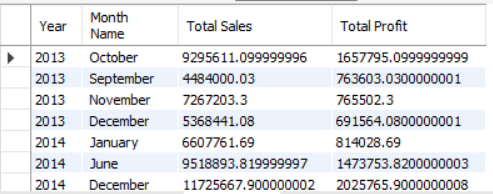
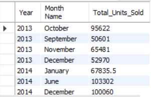
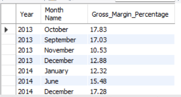
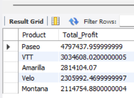
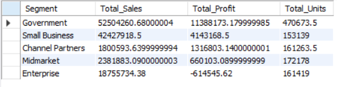
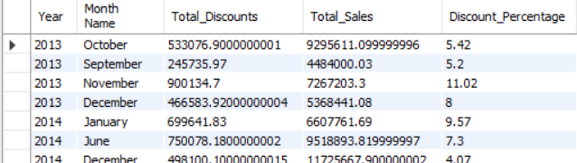
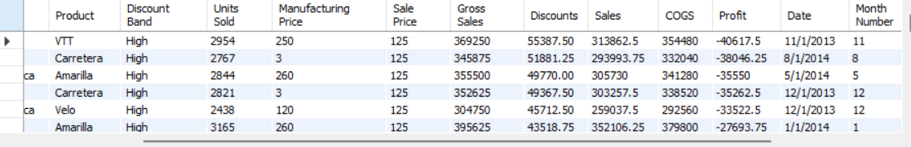
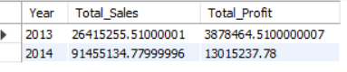

# Day_6
---


# 📊 Financial Sales Analysis using SQL

## 🔍 Project Overview

This project performs a comprehensive financial analysis of global sales data using SQL. The dataset includes transactional and product-level details such as revenue, units sold, discounts, profit, segment, and more.

The analysis focuses on uncovering key trends and insights related to:

- Monthly sales and profit trends  
- Profitability by product and segment  
- Impact of discounts on revenue  
- Regional sales performance  
- Loss-making transactions  
- Volume vs. value comparisons  

---

## 📁 Dataset Schema

| Column Name         | Description                                  |
|---------------------|----------------------------------------------|
| Segment             | Customer segment                             |
| Country             | Country of sale                              |
| Product             | Product name                                 |
| Discount Band       | Discount category                            |
| Units Sold          | Number of units sold                         |
| Manufacturing Price | Cost to produce one unit                     |
| Sale Price          | Price at which unit was sold                 |
| Gross Sales         | Units Sold × Sale Price                      |
| Discounts           | Total discount amount applied                |
| Sales               | Net revenue after discounts                  |
| COGS                | Cost of Goods Sold                           |
| Profit              | Net profit (Sales - COGS)                    |
| Date                | Date of transaction                          |
| Month Number        | Numeric value of the month                   |
| Month Name          | Name of the month                            |
| Year                | Year of the transaction                      |

---

## 🔸 1. Monthly Sales and Profit

```sql
SELECT 
  Year,
  `Month Name`,
  SUM(`Sales`) AS Total_Sales,
  SUM(Profit) AS Total_Profit
FROM sales
GROUP BY Year, `Month Name`
ORDER BY 
  Year,
  MONTH(STR_TO_DATE(`Month Name`, '%M'));
```

📸 **Output:**



---

## 🔸 2. Monthly Units Sold

```sql
SELECT 
  Year,
  `Month Name`,
  SUM(`Units Sold`) AS Total_Units_Sold
FROM sales
GROUP BY Year, `Month Name`
ORDER BY 
  Year,
  MONTH(STR_TO_DATE(`Month Name`, '%M'));
```

📸 **Output:**



---

## 🔸 3. Gross Margin Percentage (Monthly)

```sql
SELECT 
  Year,
  `Month Name`,
  ROUND(SUM(Profit) / SUM(Sales) * 100, 2) AS Gross_Margin_Percentage
FROM sales
GROUP BY Year, `Month Name`
ORDER BY 
  Year,
  MONTH(STR_TO_DATE(`Month Name`, '%M'));
```

📸 **Output:**



---

## 🔸 4. Top 5 Products by Profit

```sql
SELECT 
  Product,
  SUM(Profit) AS Total_Profit
FROM sales
GROUP BY Product
ORDER BY Total_Profit DESC
LIMIT 5;
```

📸 **Output:**



---

## 🔸 5. Country-Wise Revenue and Profit

```sql
SELECT 
  Country,
  SUM(Sales) AS Total_Sales,
  SUM(Profit) AS Total_Profit
FROM sales
GROUP BY Country
ORDER BY Total_Sales DESC;
```

📸 **Output:**


---

## 🔸 6. Segment-Wise Financial Performance

```sql
SELECT 
  Segment,
  SUM(Sales) AS Total_Sales,
  SUM(Profit) AS Total_Profit,
  SUM(`Units Sold`) AS Total_Units
FROM sales
GROUP BY Segment
ORDER BY Total_Profit DESC;
```

📸 **Output:**



---

## 🔸 7. Discount Impact Over Time

```sql
SELECT 
  Year,
  `Month Name`,
  SUM(Discounts) AS Total_Discounts,
  SUM(Gross_Sales) AS Gross_Sales,
  ROUND(SUM(Discounts) / SUM(Gross_Sales) * 100, 2) AS Discount_Percentage
FROM sales
GROUP BY Year, `Month Name`
ORDER BY 
  Year,
  MONTH(STR_TO_DATE(`Month Name`, '%M'));
```

📸 **Output:**



---

## 🔸 8. Loss-Making Records (Profit < 0)

```sql
SELECT *
FROM sales
WHERE Profit < 0
ORDER BY Profit ASC;
```

📸 **Output:**



---

## 🔸 9. Average Selling Price Per Unit (Product Level)

```sql
SELECT 
  Product,
  ROUND(SUM(Sales) / SUM(`Units Sold`), 2) AS Avg_Selling_Price
FROM sales
GROUP BY Product
ORDER BY Avg_Selling_Price DESC;
```

📸 **Output:**


---

## 🔸 10. Year-over-Year (YoY) Growth in Sales and Profit

```sql
SELECT 
  Year,
  SUM(Sales) AS Total_Sales,
  SUM(Profit) AS Total_Profit
FROM sales
GROUP BY Year
ORDER BY Year;
```

📸 **Output:**



---

## 🛠️ Tools Used

- **MySQL Workbench** for writing and executing queries  
- **Excel / Tableau / Power BI** (optional) for visualization  
- **Markdown** for documentation  
- **Screenshots** taken from query result outputs

---

## 📁 Folder Structure

```
project-folder/
├── README.md
├── queries/
│   └── financial_analysis_queries.sql
├── screenshots/
│   ├── monthly_sales.png
│   ├── units_sold.png
│   ├── gross_margin.png
│   └── ...more screenshots
└── data/
    └── Financial Sample.csv
```

---
